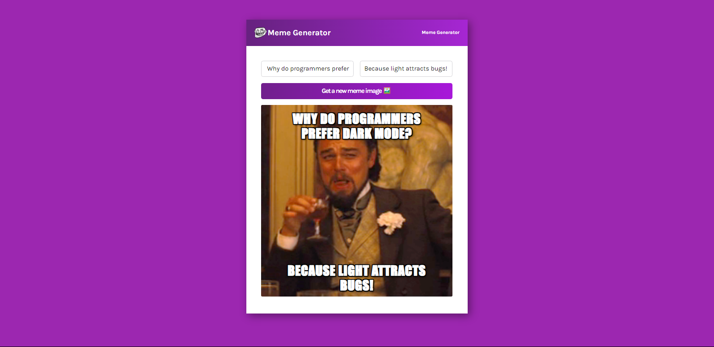

# Meme Generator

</img>

## Try it Live!

Check out the live app [Meme Generator](https://memes-generator-olive.vercel.app/)

## How to Use

-   Enter a setup line for your joke in the left input.
-   Enter a punchline for your joke in the right input.
-   Click on 'Get a New Image.'
-   The app will display a random image for you."

## Tools Used

-   React
-   imgflip API
-   CSS
-   Vite

## Getting Started

1. Clone this repository.

    ```bash
    git clone https://github.com/mahmoud-mohsen-dev/memes-generator.git
    ```

2. Navigate to the Project Directory:
    ```bash
    cd memes-generator
    ```
3. Install Dependencies:

    ```bash
     npm install
    ```

4. Development Server

    ##### Start the Development Server:

    ```bash
    npm run dev
    ```

5. Open in your Browser:

    Open your web browser and go to http://localhost:3000 to see the app in action.

Now you have the "Memes Generator" app up and running on your local machine.

_This poject was part of Scrimba React Course_
